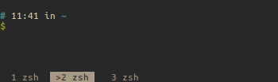
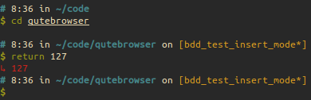

## What's in there?

This is meant to be a 'minimal', distraction free setup.
It should automate as much as possible and keep UI clutter to a minimum.

### i3

 * i3bar is only shown when the modifier key is pressed
 * i3bar only shows the workspaces, time and tray programs

### tmux

The status display has no additional information apart from windows.

### zsh

* Custom zsh prompt/theme
* CTRL+Z to send jobs to background and to foreground
* No oh-my-zsh, because it makes things slow
* Same completion as oh-my-zsh

### X Config

**.xinitrc for i3**

Launches a couple of programs and the [i3](https://i3wm.org://i3wm.org/) window manager.

**.Xresources for urxvt configuration**

 * Gruvbox and Solarized themes
 * Clickable urls to launch firefox
 * Shortcuts to change the terminal font size
 * Font size management with Ctrl + arrow keys

### Vim

 * Support for 'line' cursor shape in insert mode if using nvim
 * Turns syntax off for large files
 * Open the current file in browser (Useful for markdown)
 * Return to the same line when you reopen a file

### Git

 * Pre-defined commit message with suggestions

### Ruby

 * Basic rubocop.yml
 * irbrc - start pry if possible
 * gemrc - never download docs

### Scripts in bin/

 * `clean_rails` cleans cache and log files in rails projects
 * `lock.sh` Locks the screen with a blurred screenshot of the current screen.
   Requires `scrot`, `imagemagick` and `i3lock`
 * `off` Will ask you to do a daily review, time tracking and if you are fine with your journaling and then suspend the machine.

## Installation

### System bootstrapping

Just run the following command:

    wget --no-check-certificate https://github.com/phansch/dotfiles/raw/master/setup -O - | bash

This will:

1. Setup [Ansible](https://www.ansible.com/)
2. Upgrade and autoclean system packages
3. Clone the dotfiles (or pull if they exist already)
4. Run the [base playbook](https://github.com/phansch/dotfiles/blob/master/ansible/playbooks/base.yml) to install the prerequisites
5. Run the [dotfiles playbook](https://github.com/phansch/dotfiles/blob/master/ansible/playbooks/dotfiles.yml) to symlink the dotfiles
7. Print the command to run the optional playbooks

### Just the dotfiles

If you just want the dotfiles, clone them and use [stow](https://www.gnu.org/software/stow/) as below.

    git clone https://github.com/phansch/dotfiles.git $HOME/.dotfiles

    cd $HOME

    # Install stow
    sudo apt-get install stow

    # To install the ruby dotfiles. Replace Ruby with the stow package you want.
    # See ansible/playbooks/dotfiles.yml for a complete list of the stow packages.
    stow ruby --verbose=1 --target=$HOME/ --dir=$HOME/.dotfiles

### Environment variables

Some scripts like the off script use environment variables for configuration.
You can set these in your `~/.zshrc.local` which is sourced by `~/.zshrc` automatically.

The current environment variables are:

| Variable           | Function                                                      |
| ------------------ | ------------------------------------------------------------- |
| DAILY_REVIEW_LINK  | If set, opens the configured link when using the `off` script |
| WORK_TIME_TRACKING | If set, opens the configured link when using the `off` script |

## Development

Since it can be a bit problematic to test changes to the configuration on the actual machine where you want to make them, you can use Vagrant to test changes to the configuration.

You will need Vagrant and Virtualbox installed, then you can run:

    vagrant up

You can then either use `vagrant ssh` or connect to the VM through Virtualbox to have a GUI.

**Re-running a failed ansible playbook**

    ansible-playbook ansible/playbooks/<the-playbook>.yml

**Running the tests**

    run-parts test/

### CI Info

CI is trying to mirror a full Ubuntu installation in order to ensure the setup script doesn't fail.

All ansible playbooks are run on CI. The build will fail if:

* Any ansible playbook has not finished successfully
* i3 config is invalid
* `ansible-playbook --syntax-check` has not finished successfully
* shellcheck found errors
