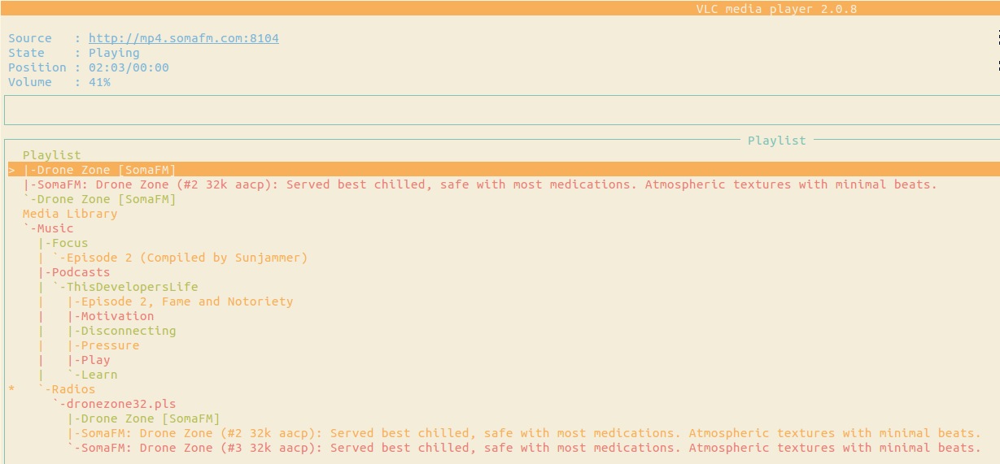
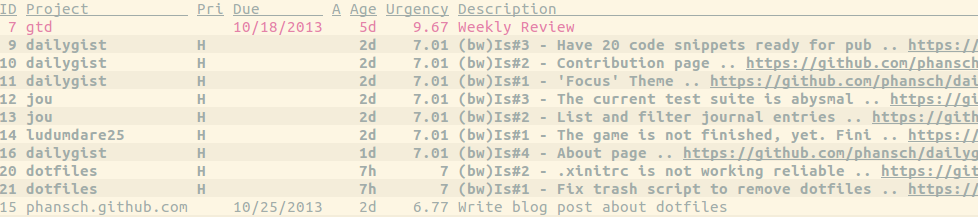
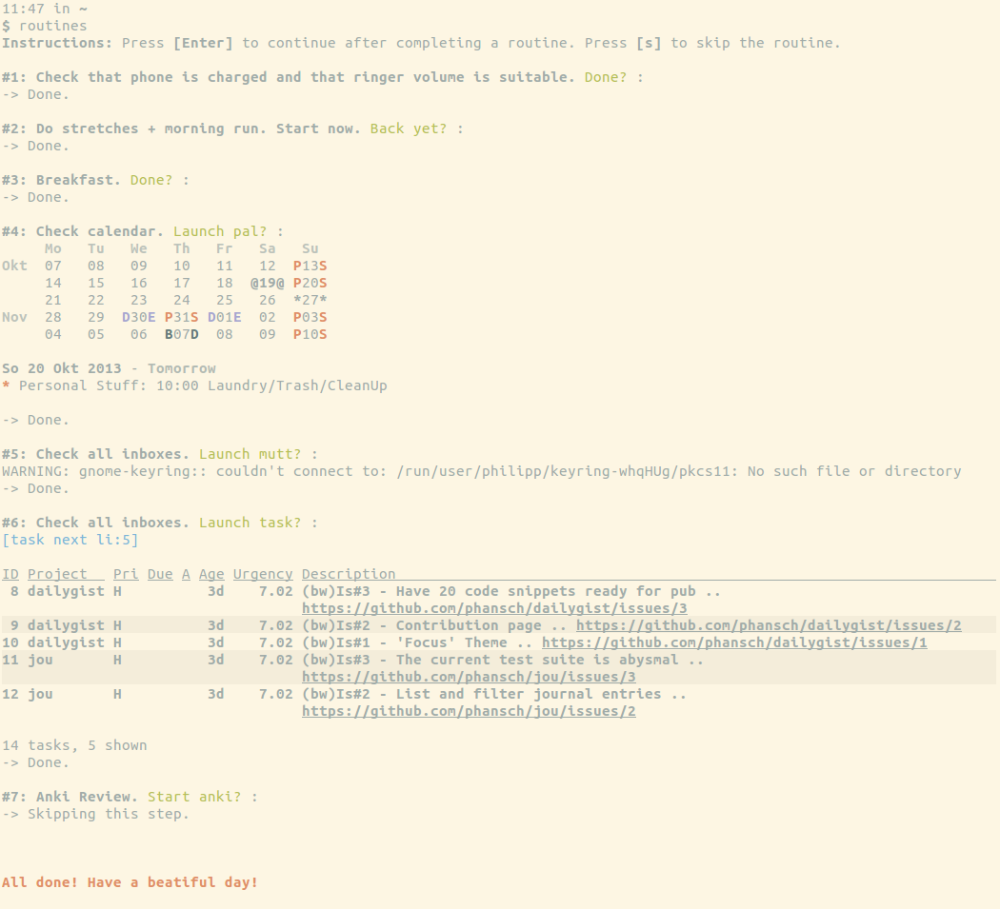

## Installation

    wget --no-check-certificate https://gitlab.com/phansch/dotfiles/raw/master/setup -O - | bash

## What's in there?
### oh-my-zsh

##### Custom zsh prompt (aka zsh-theme) and syntax highlighting plugin

##### Tab-completion plugin for ~ and ~/code/ directories
    c pha<tab> #c phansch.github.com/
    h .dot<tab> #h .dotfiles/

From https://github.com/ryanb/dotfiles but without rake and cap completion.
### X Config

##### .xinitrc for dwm
The script is pretty much self explanatory, but here's the gist:

 * Screen setup with xrandr
 * Launch a ton of programs:
   * redshift, [btsync](http://labs.bittorrent.com/experiments/sync.html), unclutter, emptytrash, feh, [bugwarrior-pull](https://github.com/ralphbean/bugwarrior)
   * [vlc ncurses with playlist](http://www.videolan.org/doc/play-howto/en/ch04.html#id590986)
   * Applets for dwm systray
   * And finally: [dwm](http://dwm.suckless.org/)

##### .Xresources for urxvt configuration
 * Gruvbox and Solarized themes
 * Clickable urls to launch firefox
 * Shortcuts to change the terminal font size

### task
*.taskrc* remains pretty basic so far. We just set the .task data fodler to ~/.task/ and use the provided theme.

### Scripts in bin/
 
  * `emptytrash` clears the trash (/home/$USER/.local/share/Trash). 
  * `hub` adds github support to the git command
  * `routines` helps me stick to my routines in the morning

Here's a screenshot of the `routines` output:

## Development

Currently only tested with Linux Mint XFCE, which you can get [here](https://linuxmint.com/edition.php?id=214)

Once downloaded, open a terminal and set `IMAGE_PATH` to the path where the .iso is located.

    IMAGE_PATH=$HOME/Downloads/linuxmint-17.3-xfce-64bit.iso

Then run the dev-setup.sh:

    ./dev-setup

Now you'll have to go through the installation process of Linux Mint.
